# 📊 Stok & Fiyat Yönetimi Chatbot - Flow Diyagramları

## 🎯 Ana Flow Yapısı

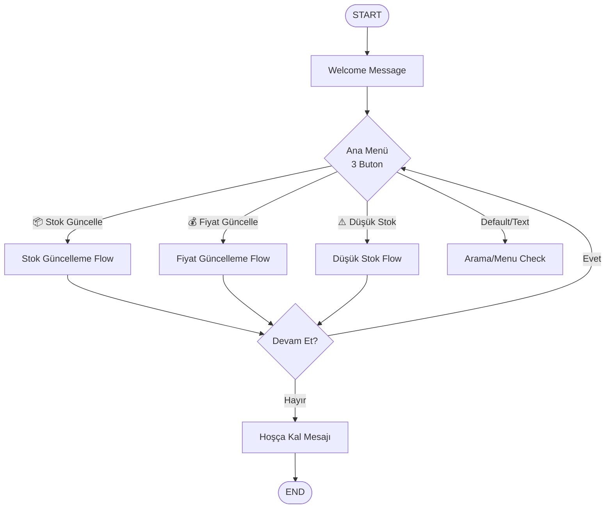

---

## 📦 Stok Güncelleme Flow (Detaylı)

```mermaid
graph TD
    START_STOCK[Stok Güncelle Butonu] --> API_CAT[API: Kategorileri Getir]

    API_CAT -->|Success| CAT_LIST{Kategori Listesi<br/>Dynamic List}
    API_CAT -->|Error| CAT_ERROR[Hata Mesajı:<br/>Kategoriler yüklenemedi]
    CAT_ERROR --> BACK_MENU[Ana Menü]

    CAT_LIST --> API_PROD[API: Kategoriye Göre<br/>Ürünleri Getir]

    API_PROD -->|Success| CHECK_EMPTY{Ürün Var mı?}
    API_PROD -->|Error| PROD_ERROR[Hata Mesajı:<br/>Ürünler yüklenemedi]
    PROD_ERROR --> BACK_MENU

    CHECK_EMPTY -->|Hayır| NO_PROD[Ürün Bulunamadı<br/>Mesajı]
    NO_PROD --> BACK_MENU

    CHECK_EMPTY -->|Evet| PROD_LIST{Ürün Listesi<br/>Dynamic List}
    PROD_LIST --> API_DETAIL[API: Ürün Detayı Getir]

    API_DETAIL -->|Success| SHOW_STOCK[Mevcut Stok Göster<br/>Ürün: X<br/>Stok: Y adet]
    API_DETAIL -->|Error| DETAIL_ERROR[Detay Hatası]
    DETAIL_ERROR --> BACK_MENU

    SHOW_STOCK --> INPUT_STOCK[Yeni Stok Gir<br/>Text Input]
    INPUT_STOCK --> VALIDATE{Geçerli mi?<br/>">= 0"}

    VALIDATE -->|Hayır| INVALID[Geçersiz Stok!<br/>0 veya üstü girin]
    INVALID --> INPUT_STOCK

    VALIDATE -->|Evet| API_UPDATE[API: Stok Güncelle<br/>PUT /products/id]

    API_UPDATE -->|Success| SUCCESS[✅ Başarılı!<br/>Eski: X → Yeni: Y]
    API_UPDATE -->|Error| UPDATE_ERROR[Güncelleme Hatası]
    UPDATE_ERROR --> BACK_MENU

    SUCCESS --> CONTINUE{Devam Et?}

    style START_STOCK fill:#e3f2fd
    style API_CAT fill:#fff3e0
    style API_PROD fill:#fff3e0
    style API_DETAIL fill:#fff3e0
    style API_UPDATE fill:#fff3e0
    style SUCCESS fill:#c8e6c9
    style CAT_ERROR fill:#ffcdd2
    style PROD_ERROR fill:#ffcdd2
    style DETAIL_ERROR fill:#ffcdd2
    style UPDATE_ERROR fill:#ffcdd2
```

---

## 💰 Fiyat Güncelleme Flow (Detaylı)

```mermaid
graph TD
    START_PRICE[Fiyat Güncelle Butonu] --> API_BRAND[API: Markaları Getir]

    API_BRAND -->|Success| BRAND_LIST{Marka Listesi<br/>Dynamic List}
    API_BRAND -->|Error| BRAND_ERROR[Hata Mesajı:<br/>Markalar yüklenemedi]
    BRAND_ERROR --> BACK_MENU[Ana Menü]

    BRAND_LIST --> API_BRAND_PROD[API: Markaya Göre<br/>Ürünleri Getir]

    API_BRAND_PROD -->|Success| CHECK_BRAND_EMPTY{Ürün Var mı?}
    API_BRAND_PROD -->|Error| BRAND_PROD_ERROR[Hata Mesajı:<br/>Ürünler yüklenemedi]
    BRAND_PROD_ERROR --> BACK_MENU

    CHECK_BRAND_EMPTY -->|Hayır| NO_BRAND_PROD[Bu Markada<br/>Ürün Yok]
    NO_BRAND_PROD --> BACK_MENU

    CHECK_BRAND_EMPTY -->|Evet| BRAND_PROD_LIST{Ürün Listesi<br/>Dynamic List}
    BRAND_PROD_LIST --> API_BRAND_DETAIL[API: Ürün Detayı Getir]

    API_BRAND_DETAIL -->|Success| SHOW_PRICE[Mevcut Fiyat Göster<br/>Ürün: X<br/>Fiyat: Y TL]
    API_BRAND_DETAIL -->|Error| BRAND_DETAIL_ERROR[Detay Hatası]
    BRAND_DETAIL_ERROR --> BACK_MENU

    SHOW_PRICE --> INPUT_PRICE[Yeni Fiyat Gir<br/>Text Input]
    INPUT_PRICE --> VALIDATE_PRICE{Geçerli mi?<br/>"&gt; 0"}

    VALIDATE_PRICE -->|Hayır| INVALID_PRICE[Geçersiz Fiyat!<br/>0'dan büyük girin]
    INVALID_PRICE --> INPUT_PRICE

    VALIDATE_PRICE -->|Evet| API_UPDATE_PRICE[API: Fiyat Güncelle<br/>PUT /products/id]

    API_UPDATE_PRICE -->|Success| PRICE_SUCCESS[✅ Başarılı!<br/>Eski: X TL → Yeni: Y TL]
    API_UPDATE_PRICE -->|Error| PRICE_UPDATE_ERROR[Güncelleme Hatası]
    PRICE_UPDATE_ERROR --> BACK_MENU

    PRICE_SUCCESS --> CONTINUE{Devam Et?}

    style START_PRICE fill:#e3f2fd
    style API_BRAND fill:#fff3e0
    style API_BRAND_PROD fill:#fff3e0
    style API_BRAND_DETAIL fill:#fff3e0
    style API_UPDATE_PRICE fill:#fff3e0
    style PRICE_SUCCESS fill:#c8e6c9
    style BRAND_ERROR fill:#ffcdd2
    style BRAND_PROD_ERROR fill:#ffcdd2
    style BRAND_DETAIL_ERROR fill:#ffcdd2
    style PRICE_UPDATE_ERROR fill:#ffcdd2
```

---

## ⚠️ Düşük Stok Raporu Flow (Detaylı)

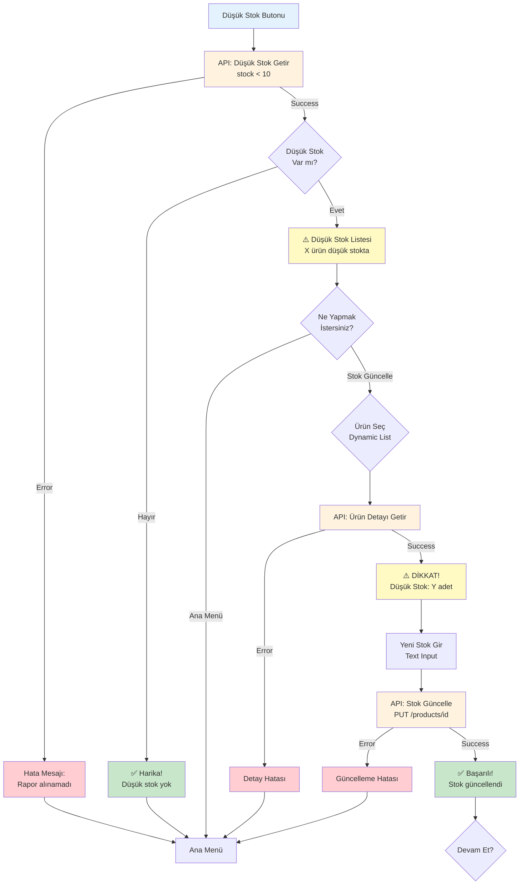

---

## 🔄 Edge Routing Türleri

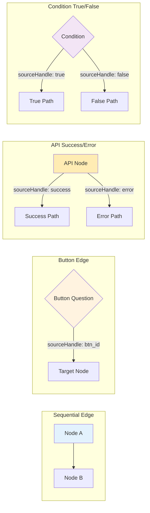

---

## 🛡️ Hata Yönetimi Patterns

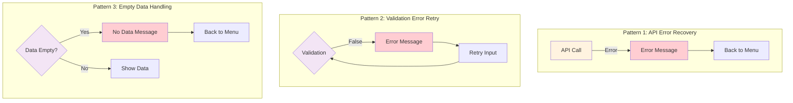

---

## 📊 Variable Flow (Stok Güncelleme Örneği)

```mermaid
graph TD
    START_VAR[START] --> SET1["Set: main_menu_choice<br/>'stock_update'"]
    SET1 --> API1[API: Get Categories]
    API1 --> SET2["Set: categories<br/>[array of categories]"]
    SET2 --> USER1[User Selects Category]
    USER1 --> SET3["Set: selected_category_slug<br/>'bahce-ekipmanlari'"]
    SET3 --> API2["API: Get Products<br/>URL uses {{selected_category_slug}}"]
    API2 --> SET4["Set: products_by_category<br/>[array of products]"]
    SET4 --> USER2[User Selects Product]
    USER2 --> SET5["Set: selected_product_id<br/>'prod123'"]
    SET5 --> API3["API: Get Detail<br/>URL uses {{selected_product_id}}"]
    API3 --> SET6["Set: product_detail<br/>{name, sku, stock, price}"]
    SET6 --> SHOW["Show: {{product_detail.name}}<br/>{{product_detail.stock}} adet"]
    SHOW --> USER3[User Enters New Stock]
    USER3 --> SET7["Set: new_stock_amount<br/>'150'"]
    SET7 --> API4["API: Update<br/>Body: {stock: {{new_stock_amount}}}"]
    API4 --> SET8["Set: update_result<br/>{updated product}"]
    SET8 --> FINAL["Show: Eski {{product_detail.stock}}<br/>Yeni {{new_stock_amount}}"]

    style SET1 fill:#e1f5fe
    style SET2 fill:#e1f5fe
    style SET3 fill:#e1f5fe
    style SET4 fill:#e1f5fe
    style SET5 fill:#e1f5fe
    style SET6 fill:#e1f5fe
    style SET7 fill:#e1f5fe
    style SET8 fill:#e1f5fe
    style API1 fill:#fff3e0
    style API2 fill:#fff3e0
    style API3 fill:#fff3e0
    style API4 fill:#fff3e0
```

---

## 🎨 Dynamic List Processing

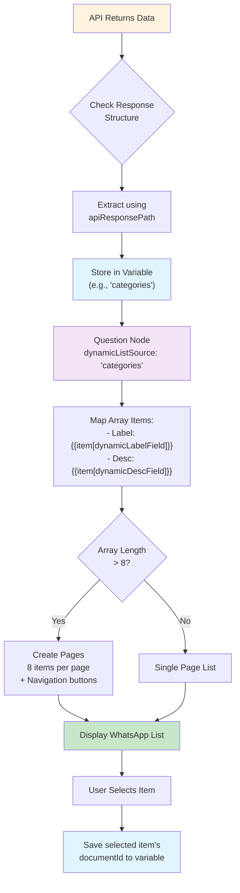

---

## 🔀 Chatbot Node Type Distribution

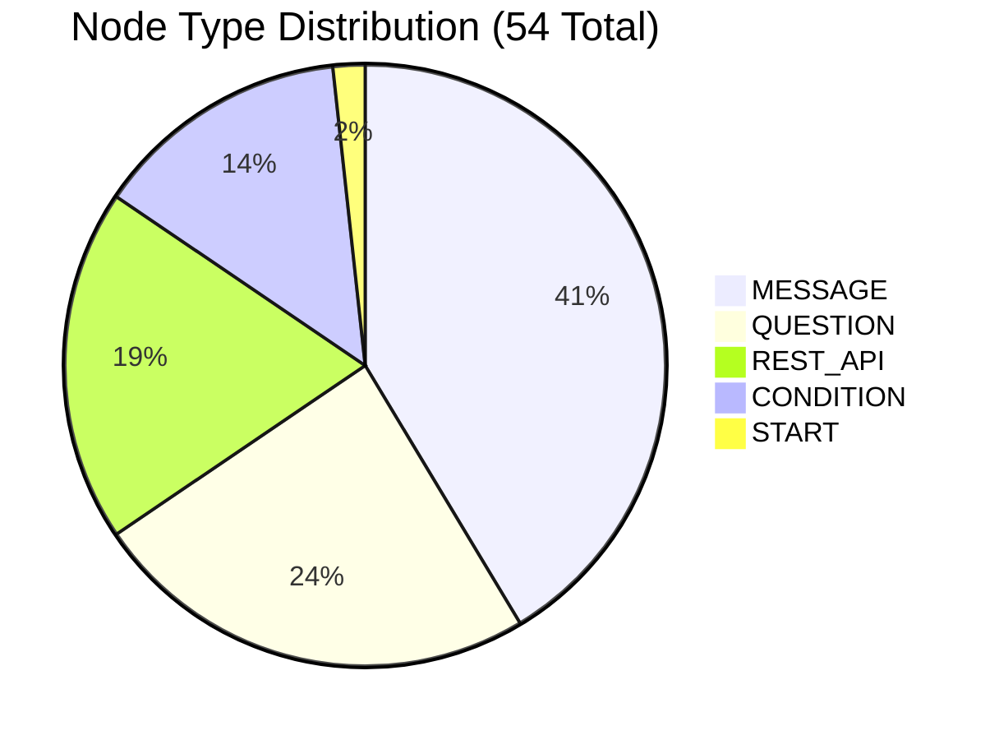

---

## 📈 API Call Frequency by Flow

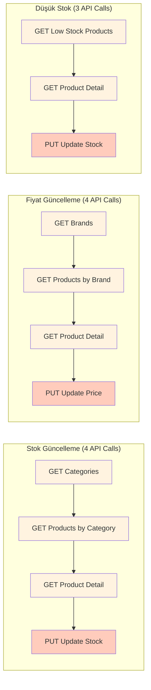

---

## 🎯 Complete User Journey (Stok Güncelleme)

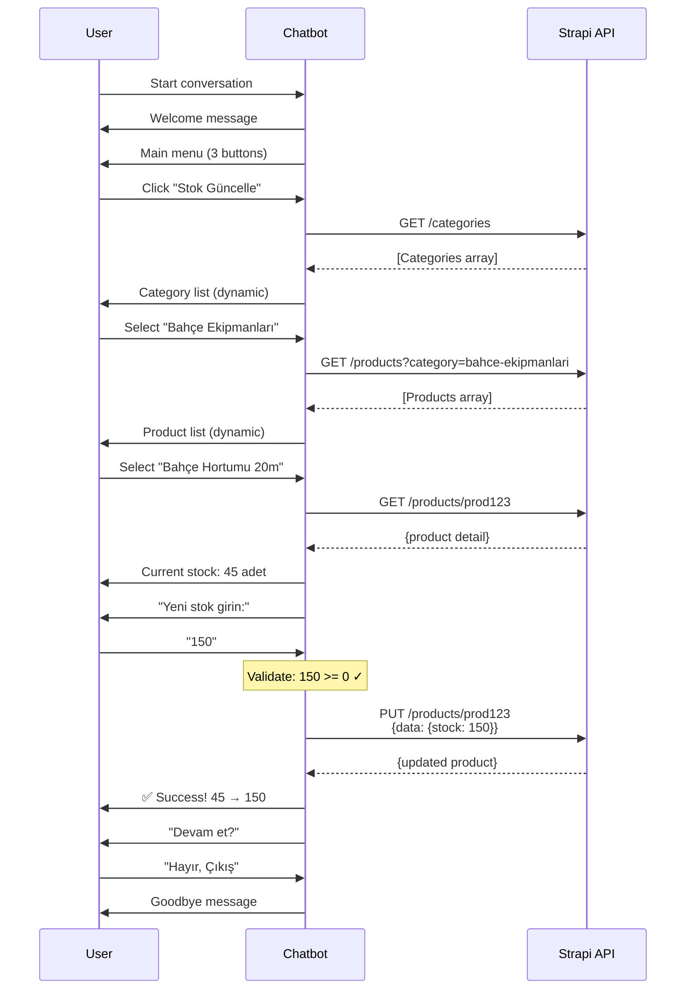

---

## 🔐 Error Recovery Journey

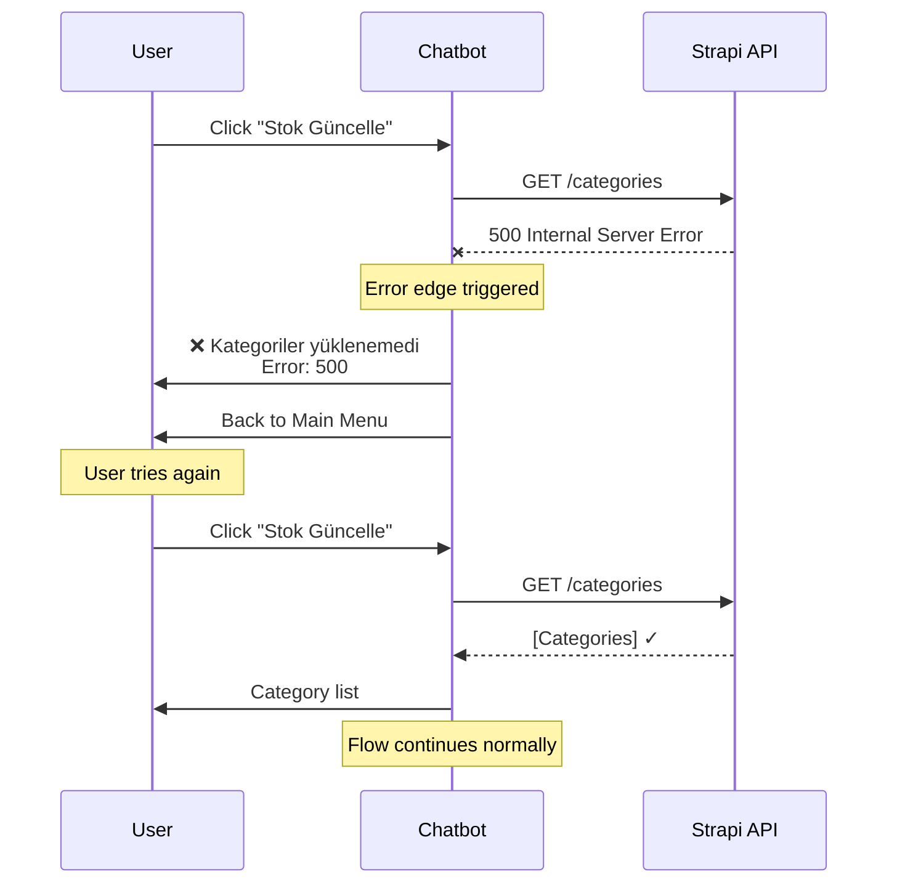

---

## 📊 Validation Flow Example

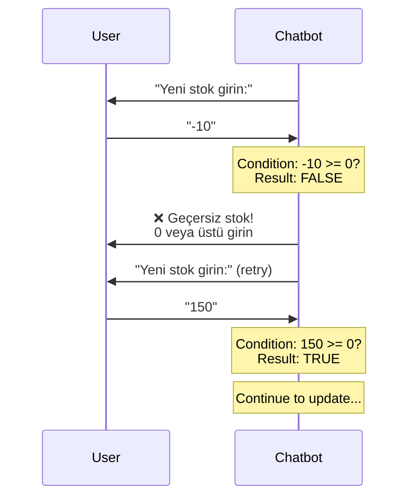

---

## 🗺️ Complete System Architecture

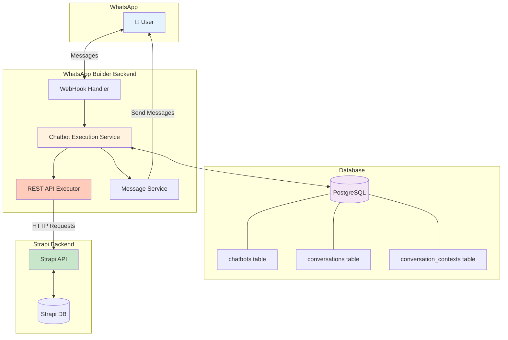

---

## 📝 Legend

### Node Colors
- 🔵 **Blue** (#e3f2fd): Start/Entry points
- 🟡 **Yellow** (#fff3e0): API calls
- 🟢 **Green** (#c8e6c9): Success states
- 🔴 **Red** (#ffcdd2): Error states
- 🟣 **Purple** (#f3e5f5): Conditions/Decisions
- 🟠 **Orange** (#ffccbc): Update/PUT operations
- ⚪ **Light Yellow** (#fff9c4): Warning/Alert states

### Node Shapes
- **Rectangle**: Process/Action
- **Diamond**: Decision/Condition
- **Rounded Rectangle**: Start/End
- **Parallelogram**: Input/Output
- **Circle**: Connection point

---

**Flow Diagram Version**: 1.0.0
**Created**: 2025-11-27
**Format**: Mermaid.js

**Note**: Bu diyagramları Markdown destekleyen herhangi bir platformda (GitHub, GitLab, Notion, vb.) görselleştirebilirsiniz.
