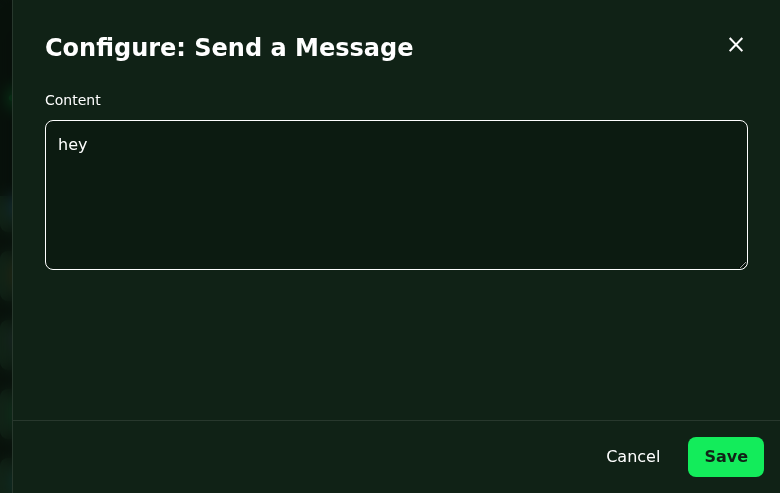
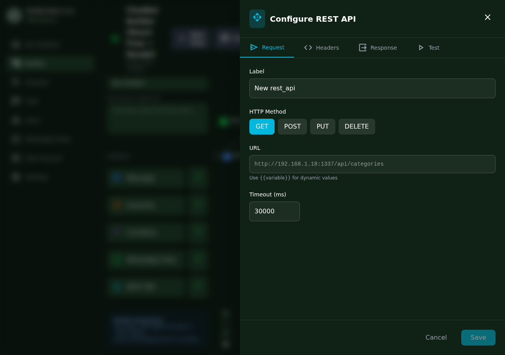

# Node Types

Chatbot Builder'da kullanabileceginiz 7 farkli node tipi bulunmaktadir. Her node tipi farkli bir islev sunar ve cesitli yapilandirma seceneklerine sahiptir.

## Node Listesi

Sidebar'daki **NODES** bölümünden tüm node tiplerini görebilir ve canvas'a ekleyebilirsiniz.


---

## 1. Start Node

**Amaç**: Flow'un başlangıç noktasıdır. Her akışta yalnızca bir Start Node bulunur.

| Özellik | Değer |
|---------|-------|
| **Type** | `start` |
| **Renk** | Yeşil |
| **Handles** | Yalnızca çıkış (sağ taraf) |
| **Silinebilir** | Hayır |
| **Yapılandırma** | Yok |

Start Node otomatik olarak oluşturulur ve silinemez. Akışınızın ilk node'u buraya bağlanmalıdır.

---

## 2. Message Node

**Amaç**: Kullanıcıya metin mesajı gönderir.

| Özellik | Değer |
|---------|-------|
| **Type** | `message` |
| **Renk** | Mavi |
| **Handles** | Giriş (sol) + Çıkış (sağ) |
| **Icon** | 💬 chat |

### Message Node Yapılandırması



| Alan | Açıklama |
|------|----------|
| **Content** | Gönderilecek mesaj metni |

**Kullanım Örneği**: Hoş geldiniz mesajı, bilgilendirme, veda mesajı

---

## 3. Question Node

**Amaç**: Kullanıcıdan girdi alır. Üç farklı alt tipi vardır.

| Özellik | Değer |
|---------|-------|
| **Type** | `question` |
| **Renk** | Turuncu |
| **Handles** | Giriş (sol) + Dinamik çıkışlar |
| **Icon** | ❓ help |

### Question Type Seçimi

Question Node eklerken önce soru tipini seçmeniz gerekir:


### 3.1 Text Question

Kullanıcıdan serbest metin girdisi alır.

| Özellik | Değer |
|---------|-------|
| **Handles** | Tek çıkış |
| **Variable** | Cevabı kaydetmek için değişken adı |

### 3.2 Buttons Question

WhatsApp Interactive Buttons formatında seçenekler sunar.


| Alan | Açıklama |
|------|----------|
| **Header Text** | (Opsiyonel) Başlık metni |
| **Body Text** | (Zorunlu) Soru metni |
| **Footer Text** | (Opsiyonel) Alt bilgi |
| **Buttons** | Maksimum 3 buton (WhatsApp limiti) |
| **Variable Name** | Seçilen butonu kaydetmek için değişken |

**Handles**: Her buton için ayrı çıkış + Default handle

### 3.3 List Question

WhatsApp Interactive List formatında seçenekler sunar.

| Alan | Açıklama |
|------|----------|
| **Sections** | Liste bölümleri |
| **Rows** | Her bölümdeki seçenekler (max 10) |
| **Variable Name** | Seçilen öğeyi kaydetmek için değişken |

---

## 4. Condition Node

**Amaç**: Koşullu dallanma sağlar. Bir değişkenin değerine göre akışı yönlendirir.

| Özellik | Değer |
|---------|-------|
| **Type** | `condition` |
| **Renk** | Mor |
| **Handles** | Giriş (sol) + True/False çıkışları |
| **Icon** | 🔀 call_split |

### Condition Node Yapılandırması


| Alan | Açıklama |
|------|----------|
| **Label** | Node etiketi |
| **Variable** | Kontrol edilecek değişken |
| **Operator** | Karşılaştırma operatörü |
| **Value** | Karşılaştırılacak değer |

### Kullanılabilir Operatörler

| Operatör | Açıklama |
|----------|----------|
| `==` | Eşit |
| `!=` | Eşit değil |
| `>` | Büyük |
| `<` | Küçük |
| `>=` | Büyük veya eşit |
| `<=` | Küçük veya eşit |
| `contains` | İçerir |
| `does not contain` | İçermez |

### Multi-Condition Support (Condition Groups)

Condition node artik coklu kosul gruplarini desteklemektedir. Birden fazla kosulu AND veya OR ile birlestirerek karmasik mantik kurabilirsiniz.

```json
{
  "conditionGroup": {
    "conditions": [
      { "id": "c1", "variable": "age", "operator": "gt", "value": "18" },
      { "id": "c2", "variable": "country", "operator": "eq", "value": "TR" }
    ],
    "logicalOperator": "AND"
  }
}
```

Detaylar icin [Backend Execution Details](07-backend-execution.md) dokumanina bakin.

**Onemli**: Condition Node'dan once en az bir Question Node olmali ve variable tanimlanmis olmalidir.

### BUTTONS/LIST Selection Davranisi

BUTTONS veya LIST sorularinda kullanici secim yaptiginda, backend **ID** degerini kaydeder (title degil). Bu sayede condition kontrollerinde ID karsilastirmasi yapilabilir.

Ornek: Kullanici "Berber Randevu" butonuna tikladiginda `selected_service` variable'ina `"berber"` (button ID) kaydedilir, `"Berber Randevu"` degil.

---

## 5. WhatsApp Flow Node

**Amaç**: Meta WhatsApp Flows tetikler. Form toplama, anket gibi interaktif deneyimler sunar.

| Özellik | Değer |
|---------|-------|
| **Type** | `whatsapp_flow` |
| **Renk** | Yeşil gradient |
| **Handles** | Giriş (sol) + Çıkış (sağ) |
| **Icon** | ✅ check_box |

### WhatsApp Flow Node Yapılandırması

| Alan | Açıklama |
|------|----------|
| **Flow ID** | Meta Flow ID |
| **CTA Text** | Call-to-action buton metni |
| **Mode** | `draft` veya `published` |

---

## 6. Google Calendar Node

**Amac**: Google Calendar entegrasyonu ile takvim islemleri yapar. Etkinlikleri listeler, musaitlik kontrolu yapar.

| Ozellik | Deger |
|---------|-------|
| **Type** | `google_calendar` |
| **Renk** | Yesil (emerald gradient) |
| **Handles** | Giris (sol) + Cikis (sag) |
| **Icon** | Calendar icon |

### Google Calendar Node Yapılandırması

| Alan | Aciklama |
|------|----------|
| **Label** | Node etiketi |
| **Action** | Yapmak istenen islem (asagida detayli) |
| **Calendar Owner** | Hangi kullanicinin takviminin kullanilacagi |
| **Output Variable** | Sonucu kaydetmek icin degisken adi |

### Action Secenekleri

| Action | Aciklama |
|--------|----------|
| `get_today_events` | Bugunun etkinliklerini listeler |
| `get_tomorrow_events` | Yarinin etkinliklerini listeler |
| `get_events_by_date` | Belirli tarih araligindaki etkinlikleri listeler |
| `check_availability` | Musait zaman dilimlerini kontrol eder |

### Calendar Owner Secenekleri

| Owner Type | Aciklama |
|------------|----------|
| **Chatbot Owner** | Chatbot'un sahibinin takvimini kullanir (varsayilan) |
| **Specific User** | Dropdown'dan belirli bir kullanici secer |
| **From Variable** | Dinamik olarak degiskenden kullanici ID'si alir |

### Onemli Gereksinimler

1. **Chatbot Owner Atamasi**: Google Calendar node'unun calismasi icin chatbot'un bir owner'a (userId) atanmis olmasi gerekir.
2. **OAuth Token**: Owner'in Google Calendar OAuth entegrasyonunu tamamlamis olmasi gerekir.
3. **Users API**: Google Calendar baglantisi olan kullanicilari listelemek icin `/api/users?hasGoogleCalendar=true` endpoint'i kullanilabilir.

### Check Availability Yapilandirmasi

| Alan | Aciklama |
|------|----------|
| **Date Source** | `static` (sabit tarih) veya `variable` (degiskenden) |
| **Static Date** | Tarih secimi (YYYY-MM-DD) |
| **Working Hours** | Calisma saatleri (orn: 09:00 - 18:00) |
| **Slot Duration** | Randevu suresi (dakika) |
| **Output Format** | `all_slots` veya `available_only` |

### Ornek Kullanim: Randevu Sistemi

```
1. QUESTION: "Hangi hizmeti secersiniz?" -> service_type
2. GOOGLE_CALENDAR:
   - Action: check_availability
   - Calendar Owner: Chatbot Owner
   - Date: Tomorrow
   - Output: available_slots
3. QUESTION (List): "Musait saatler:" -> selected_time
   - Dynamic List Source: available_slots
4. MESSAGE: "Randevunuz {{selected_time}} saatine alindi!"
```

---

## 7. REST API Node

**Amac**: Harici API'lere HTTP istekleri gonderir.

| Özellik | Değer |
|---------|-------|
| **Type** | `rest_api` |
| **Renk** | Cyan-mavi gradient |
| **Handles** | Giriş (sol) + Success/Error çıkışları |
| **Icon** | 🔗 api |

### REST API Node Yapılandırması

REST API Node 4 sekmeden oluşur:

#### Request Tab



| Alan | Açıklama |
|------|----------|
| **Label** | Node etiketi |
| **HTTP Method** | GET, POST, PUT, DELETE |
| **URL** | API endpoint (`{{variable}}` desteği) |
| **Timeout** | İstek zaman aşımı (ms) |

#### Headers Tab


| Alan | Açıklama |
|------|----------|
| **Header Key** | HTTP header adı |
| **Header Value** | HTTP header değeri |
| **Add Header** | Yeni header ekleme |

#### Response Tab


| Alan | Açıklama |
|------|----------|
| **Output Variable** | Başarılı yanıtı kaydetme değişkeni |
| **JSON Path** | Yanıttan veri çıkarma (ör: `data.items[0].name`) |
| **Error Variable** | Hata mesajını kaydetme değişkeni |

#### Test Tab

API isteğini test etme arayüzü.

---

## Node İşlemleri

Her node'un üzerinde iki işlem butonu bulunur:

| Buton | İşlem |
|-------|-------|
| **⚙️ Settings** | Node yapılandırma modalını açar |
| **🗑️ Delete** | Node'u siler |

---

## Canvas Üzerinde Node'lar

Tüm node'lar canvas üzerinde görsel olarak bağlanabilir:


