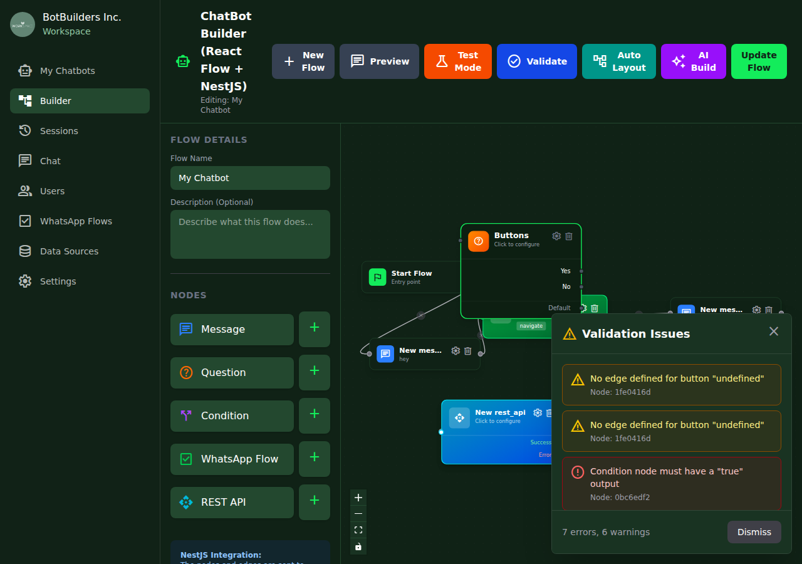

# Testing & Validation

Chatbot Builder, akışlarınızı test etmek ve doğrulamak için güçlü araçlar sunar.

---

## Test Mode

Test Mode, akışınızı gerçek bir kullanıcı gibi simüle etmenizi sağlar.

### Test Mode'a Geçiş

1. Header toolbar'daki **🧪 Test Mode** butonuna tıklayın
2. Test paneli açılır
3. **▶️ Start Test** ile simülasyonu başlatın


### Test Mode Özellikleri

| Özellik | Açıklama |
|---------|----------|
| **Step-by-Step Execution** | Akışı adım adım izleyin |
| **Message Preview** | Bot mesajlarını görüntüleyin |
| **User Input Simulation** | Kullanıcı girdilerini simüle edin |
| **Variable Tracking** | Değişken değerlerini izleyin |

### Test Mode Kontrolleri

| Buton | İşlev |
|-------|-------|
| **▶️ Start Test** | Simülasyonu başlat |
| **⏸️ Pause** | Simülasyonu duraklat |
| **⏹️ Stop** | Simülasyonu durdur |
| **🔄 Restart** | Baştan başla |

### Edit Mode'a Dönüş

Test Mode'dayken **✏️ Edit Mode** butonuna tıklayarak düzenleme moduna dönebilirsiniz.

---

## Validation (Doğrulama)

Validate özelliği, akışınızdaki hataları ve uyarıları tespit eder.

### Validation Çalıştırma

1. Header toolbar'daki **✅ Validate** butonuna tıklayın
2. Validation paneli açılır
3. Hatalar ve uyarılar listelenir



### Hata ve Uyarı Türleri

#### Hatalar (Errors) 🔴

Hatalar, akışın çalışmasını engelleyen kritik sorunlardır. Akış kaydedilemez.

| Hata | Açıklama | Çözüm |
|------|----------|-------|
| Condition node must have a "true" output | True çıkışı bağlı değil | True handle'ını bir node'a bağlayın |
| Condition node must have a "false" output | False çıkışı bağlı değil | False handle'ını bir node'a bağlayın |
| Question node must have a variable name | Değişken adı tanımlı değil | Variable Name alanını doldurun |
| Button X cannot be empty | Buton metni boş | Buton metnini girin |
| Condition node must have a variable to check | Kontrol edilecek değişken yok | Variable dropdown'dan seçim yapın |
| Condition node must have an operator | Operatör seçilmemiş | Operator dropdown'dan seçim yapın |

#### Uyarılar (Warnings) 🟡

Uyarılar, potansiyel sorunlardır. Akış kaydedilebilir ama dikkat edilmesi önerilir.

| Uyarı | Açıklama | Çözüm |
|-------|----------|-------|
| No edge defined for button "X" | Buton handle'ı bağlı değil | İlgili handle'ı bir node'a bağlayın |
| This node is not connected to any other node | Node izole durumda | Node'u akışa bağlayın veya silin |
| Condition node must have a value to compare | Karşılaştırma değeri yok | Value alanını doldurun |

### Validation Panel Bileşenleri

| Bileşen | Açıklama |
|---------|----------|
| **⚠️ Validation Issues** | Panel başlığı |
| **🔴 Error items** | Kritik hatalar |
| **🟡 Warning items** | Uyarılar |
| **Summary** | "X errors, Y warnings" özeti |
| **Dismiss** | Paneli kapat |

### Node ID ile Hata Bulma

Her hata/uyarı mesajında Node ID gösterilir:

```
Node: 1fe0416d
```

Bu ID, canvas'ta ilgili node'u bulmanıza yardımcı olur.

---

## En İyi Uygulamalar

### Akış Tasarımı

1. **Start Node'dan başlayın** - Her akış Start Node ile başlamalı
2. **Lineer akış** - Karmaşık dallanmalardan kaçının
3. **Değişken isimlendirme** - Anlamlı değişken adları kullanın
4. **Node etiketleri** - Her node'a açıklayıcı etiket verin

### Test Stratejisi

1. **Happy path** - Normal akışı test edin
2. **Edge cases** - Uç durumları kontrol edin
3. **Error handling** - Hata durumlarını simüle edin
4. **Variable values** - Değişken değerlerini doğrulayın

### Validation Kontrol Listesi

- [ ] Tüm node'lar bağlı mı?
- [ ] Condition node'ların her iki çıkışı var mı?
- [ ] Question node'larda variable tanımlı mı?
- [ ] Buton metinleri dolu mu?
- [ ] REST API URL'leri geçerli mi?

